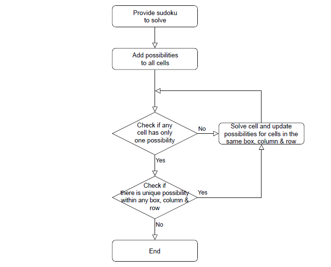

# UCS757:Building Innovative Systems
## Submitted by:-
### Garhvita Sethi
### 101803708
### COE 15

# Projects

# Project 3: Sudoku Solver
## Introduction
The web app takes an image of unsolved sudoku as the input and shows the solved sudoku

## Requirements
1. Python
2. Numpy
3. Glob
4. OpenCV-Python

## Live Link
https://sudoku-solver-ds.herokuapp.com/

## Input Interface

## Input

## Output

## Flowchart to Recognize the Sudoku
 

## Flowchart to Solve the Sudoku

## Novelty
1. Detecting sudoku in an image, can also be extended to detect it in a video stream
2. Combining Digit recognition with sudoku solving algorithms
3. Recognizing the numbers already present in the sudoku using KNN algorithm
4. Solving the sudoku using backtracking
